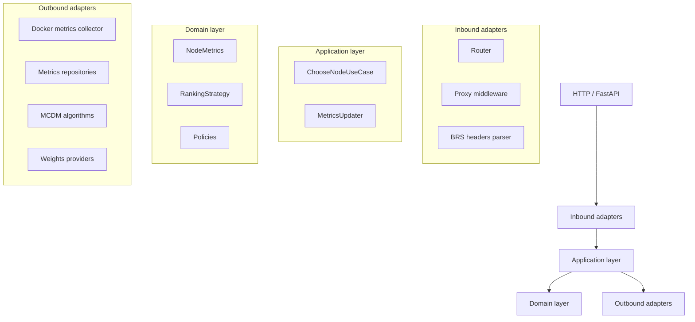

# FluxBalancer Core

`fluxbalancer-core` — это исследовательский проект балансировщика нагрузки, ориентированного на **многокритериальный
выбор узлов (MCDM)** с использованием метрик ресурсов и задержек. Проект реализует чистую слоистую архитектуру и
предназначен для экспериментов с алгоритмами принятия решений в распределённых системах.

## Основная идея

Балансировщик принимает HTTP-запрос, собирает актуальные метрики узлов (CPU, память, сеть, задержки), формирует вектор
критериев и выбирает оптимальный узел с помощью одного из MCDM-алгоритмов (TOPSIS, SAW, AIRM, ELECTRE и др.).

Алгоритм балансировки может быть выбран:

* по умолчанию (через конфигурацию),
* либо явно через HTTP-заголовки протокола BRS.

## Архитектура

Проект следует принципам Clean Architecture / Hexagonal Architecture:



### Слои

* **Inbound adapters**
  HTTP-вход (FastAPI), middleware-прокси и парсер BRS-заголовков.

* **Application layer**
  Use case’ы, управляющие выбором узла и обновлением метрик. Здесь нет привязки к FastAPI или Docker.

* **Domain layer**
  Чистая бизнес-логика: сущности, политики, стратегии ранжирования.

* **Outbound adapters**
  Интеграции с Docker, хранилищами метрик, MCDM-алгоритмами и провайдерами весов.

## MCDM-алгоритмы

Реализованы следующие методы многокритериального принятия решений:

* **TOPSIS**
* **SAW (Simple Additive Weighting)**
* **Linear Scalarization**
* **AIRM (Aggregated Indices Randomization Method)**
* **ELECTRE (упрощённый вариант)**

Все алгоритмы реализуют единый интерфейс `RankingStrategy` и могут быть подключены через реестр стратегий.

## Веса критериев

Для автоматического вычисления весов используется **энтропийный метод**:

* критерии с малой вариативностью получают меньший вес;
* критерии с высокой информативностью — больший.

Реализация: `EntropyWeightsProvider`.

## Метрики узлов

Собираемые метрики:

* загрузка CPU
* использование памяти
* сетевой трафик (rx / tx)
* latency (p95, скользящее окно)

Источник метрик — Docker (`aiodocker`).

Метрики хранятся:

* в памяти (history + sliding window),
* агрегируются с помощью EMA.

## Протокол BRS (Balancer and Replications Protocol)

Поддерживаемые HTTP-заголовки:

* `X-Service` — имя сервиса (обязательный)
* `X-Balancer-Deadline` — дедлайн в миллисекундах (обязательный)
* `X-Balancer-Strategy` — стратегия балансировки (опционально)
* `X-Replications-Count` — число репликаций
* `X-Replications-All` — реплицировать на все узлы

Валидация и парсинг заголовков выполняются строго, при ошибке запрос отклоняется.

## Запуск

```bash
poetry install
poetry run python src/main.py
```

По умолчанию сервис стартует на порту `8000`.

### Эндпоинты

* `GET /choose` — выбор узла (без проксирования)
* `GET /stats` — агрегированные метрики
* любой другой путь — проксируется на выбранный backend-узел

## Назначение проекта

Проект ориентирован на:

* исследование MCDM-подходов в балансировке нагрузки;
* экспериментирование с метриками и стратегиями выбора;
* учебные и научные цели.

Это **не production-ready балансировщик**, а расширяемая исследовательская платформа.