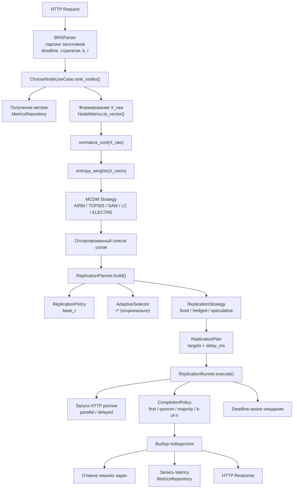

# FluxBalancer Core

`fluxbalancer-core` — это исследовательский проект балансировщика нагрузки, ориентированного на **многокритериальный
выбор узлов (MCDM)** с использованием метрик ресурсов и задержек. Проект реализует чистую слоистую архитектуру и
предназначен для экспериментов с алгоритмами принятия решений в распределённых системах.

## Архитектура

Проект следует принципам Hexagonal Architecture и DDD:

```mermaid
flowchart TD
    A[HTTP Request] --> B[BRSParser<br/>парсинг заголовков<br/>deadline, стратегия, k, r]
    B --> C["ChooseNodeUseCase.rank_nodes()"]
    C --> C1[Получение метрик<br/>MetricsRepository]
    C --> C2["Формирование X_raw<br/>NodeMetrics.to_vector()"]
    C2 --> C3["normalize_cost(X_raw)"]
    C3 --> C4["entropy_weights(X_norm)"]
    C4 --> C5[MCDM Strategy<br/>AIRM / TOPSIS / SAW / LC / ELECTRE]
    C5 --> C6[Отсортированный список узлов]
    C6 --> D["ReplicationPlanner.build()"]
    D --> D1[ReplicationPolicy<br/>base_r]
    D --> D2["AdaptiveSelector<br/>r* (опционально)"]
    D --> D3[ReplicationStrategy<br/>fixed / hedged / speculative]
    D3 --> D4[ReplicationPlan<br/>targets + delay_ms]
    D4 --> E["ReplicationRunner.execute()"]
    E --> E1[Запуск HTTP реплик<br/>parallel / delayed]
    E --> E2[CompletionPolicy<br/>first / quorum / majority / k-of-n]
    E --> E3[Deadline-aware ожидание]
    E2 --> E4[Выбор победителя]
    E4 --> E5[Отмена лишних задач]
    E4 --> E6[Запись latency<br/>MetricsRepository]
    E4 --> F[HTTP Response]
```
