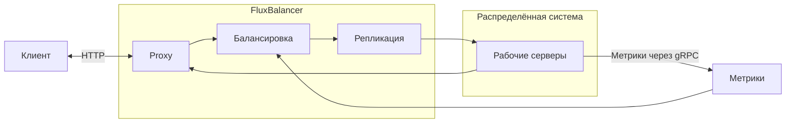

```mermaid
flowchart LR
    Client["Клиент"] <-->|HTTP| Proxy

    subgraph FluxBalancer
        Proxy --> Балансировка
        Балансировка --> Репликация
    end

    subgraph BackendSystem["Распределённая система"]
        Nodes["Рабочие серверы"]
    end

    Репликация --> Nodes
    Nodes --> Proxy
    Nodes -->|Метрики через gRPC| Метрики
    Метрики --> Балансировка
```