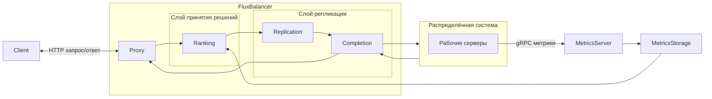

```mermaid
flowchart LR
    Client <-->|HTTP запрос/ответ| Proxy

    subgraph FluxBalancer
        subgraph "Слой принятия решений"
            Ranking
        end

        subgraph "Слой репликации"
            Replication
            Completion
        end

        Proxy --> Ranking
        Ranking --> Replication
        Replication --> Completion
    end

    Completion --> BackendSystem
    BackendSystem --> Completion
    Completion --> Proxy

    subgraph BackendSystem["Распределённая система"]
        Nodes["Рабочие серверы"]
    end

    Nodes -->|gRPC метрики| MetricsServer
    MetricsServer --> MetricsStorage
    MetricsStorage --> Ranking
```